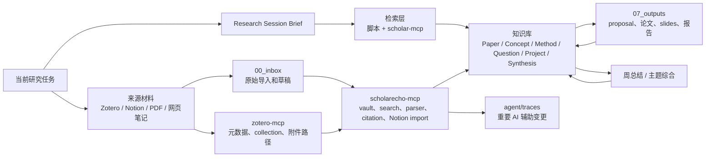

# ScholarEcho

**ScholarEcho** 不是“论文收藏夹”，而是一个本地的个人研究上下文引擎。

它的目标很克制：当你正在读论文、想问题、写 proposal 或设计实验时，系统能把相关旧知识重新带回当前任务里，而不是等你主动翻笔记。

## 设计哲学

1. **问题优先，不以论文为中心。** 论文是证据和方法来源，研究问题才是组织知识的主轴。
2. **检索优先，不依赖复习意志。** 每次 AI 工作都应该先找已有纸条、概念、问题和项目上下文，再生成新内容。
3. **少而稳定，不追求大而全。** 先维护少数高质量对象：Paper、Concept、Method、Question、Project、Synthesis。
4. **可激活，而不只是可保存。** 每条知识都要写清楚它在什么任务里有用。
5. **输出反哺。** proposal、related work、实验计划里的新判断，要回流到问题和项目上下文。

## 最小闭环

```text
当前问题
  -> 检索旧知识
  -> 读新论文或写新内容
  -> 连接到问题/概念/方法/项目
  -> 每周综合
  -> 更新下一步研究问题
```

如果一个功能不能让这个闭环更顺，它暂时不进第一版。

## 项目架构一图



更完整的说明见 `docs/architecture.md`。

## 目录结构

```text
.
├── 00_inbox/       # Zotero / Notion / 临时导入材料
├── 01_papers/      # 论文卡片：证据、方法、局限和激活条件
├── 02_concepts/    # 概念卡片：别名、触发词、相关问题
├── 03_methods/     # 方法卡片：适用场景、限制和代表论文
├── 04_questions/   # 研究问题：知识库的主索引
├── 05_projects/    # 项目上下文：当前方向、检索种子、写作状态
├── 06_synthesis/   # 周总结和主题小综述
├── 07_outputs/     # proposal、论文草稿、汇报材料
├── agent/          # AGENTS、profiles、router、skills、traces
├── docs/           # 设计原则和架构说明
├── index/          # 未来生成的索引，不是源数据
└── scripts/        # 本地维护脚本和 MCP server
```

## 现在怎么用

1. 先在 `05_projects/master_research_direction/context.md` 写下当前研究方向和 3-5 个核心问题。
2. 每次开始研究，不要先翻文件，直接启动会话召回：

```bash
make session q="你的研究问题或当前任务"
```

3. 每读一篇论文，用 `01_papers/_template.md` 建卡片，重点写“它能回答哪个问题”。
4. 如果只是想搜索旧知识：

```bash
make search q="你的关键词或研究问题"
```

5. 每周只做一次综合，不追求全量复习，只回答：这周哪些旧知识被重新连接了？哪些问题变清楚了？

```bash
make week
```

6. 定期检查哪些笔记未来可能找不回来：

```bash
make check
```

7. 如果要让支持 MCP 的客户端直接调用 ScholarEcho 工具，先检查本地 MCP server：

```bash
make scholar-mcp-check
```

如果还要连接 Zotero，先把 `.env` 或 MCP 客户端配置里的 `ZOTERO_USER_ID`、`ZOTERO_API_KEY` 等字段补好，再检查：

```bash
make zotero-mcp-check
```

## MCP 工具层

ScholarEcho 现在有两个本地 stdio MCP server：

- `scripts/scholarecho_mcp.py`：本地知识库、检索、PDF/文本解析、DOI/arXiv citation 解析、Notion 导入草稿。
- `scripts/zotero_mcp.py`：Zotero Web API 元数据、collections、tags、附件路径和 paper-card seed。

对应启动命令：

```bash
make scholar-mcp
make zotero-mcp
```

常用 MCP 工具组：

- Vault：`vault_list_notes`、`vault_read_note`、`vault_create_note`、`vault_append_note`、`vault_update_frontmatter`
- Search：`search_vault`、`search_session_brief`、`search_retrieval_health`
- Paper parser：`paper_parse_pdf`、`paper_parse_text`
- Citation：`citation_extract_ids`、`citation_resolve_doi`、`citation_resolve_arxiv`
- Notion import：`notion_list_exports`、`notion_preview_import`、`notion_import_draft`
- Zotero：`zotero_search_items`、`zotero_get_item`、`zotero_get_collections`、`zotero_get_collection_items`、`zotero_paper_card_seed`

安全边界：

- MCP 写入只面向 Markdown 草稿和知识对象，不删除源文件或 PDF。
- Notion 导入先进入 `00_inbox/notion_imports/converted/`，需要复核后再提升为 durable note。
- Zotero 密钥只放本地 `.env` 或 MCP 客户端配置，不提交到仓库。

详细配置示例见 `agent/tools/README.md`。

## 使用习惯假设

这个仓库默认你不会主动复习旧总结，所以所有工具都围绕一个现实假设设计：

```text
你只会在有当前任务时回来。
系统必须在那一刻把相关旧知识捞出来。
```

因此，好的笔记不是更长，而是更容易被再次激活。

## 多模型策略

模型供应商通过 `agent/profiles/*.yaml` 抽象，任务路由放在 `agent/router.yaml`。

- DeepSeek：批量初读、中文解释、低成本推理。
- OpenAI：跨论文综合、proposal、复杂写作。
- Local：隐私笔记、简单分类、离线处理。

模型可以换，但知识对象、检索线索、项目上下文和 trace 要稳定。

## 首批阅读文件

1. `docs/design-philosophy.md`
2. `AGENTS.md`
3. `04_questions/open_questions.md`
4. `05_projects/master_research_direction/context.md`
5. `agent/skills/read-paper/SKILL.md`
6. `agent/tools/README.md`
