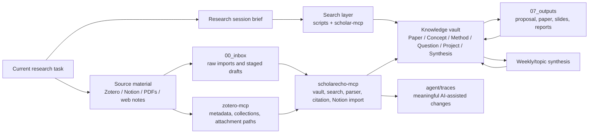

# Architecture

The architecture is intentionally small.

ScholarEcho has one job: make useful old context resurface during current research work.

## Current Architecture



The two MCP servers have different boundaries:

- `scholarecho-mcp` owns local vault operations, search, parsing, citation lookup, and Notion draft import.
- `zotero-mcp` owns Zotero metadata, collections, and attachment path discovery.

```text
Current question
  -> retrieve existing context
  -> read / think / write
  -> update the smallest useful note
  -> reconnect it to questions and projects
```

## Source Material

Zotero, Notion, PDFs, and manual notes are inputs. They are not the main knowledge structure.

Use `00_inbox/` only as a temporary landing area.

## Knowledge Objects

The durable layer has six object types:

- `01_papers/`: evidence and claims from individual papers.
- `02_concepts/`: reusable ideas and aliases.
- `03_methods/`: approaches, assumptions, and failure modes.
- `04_questions/`: active questions and missing evidence.
- `05_projects/`: current working context and retrieval seeds.
- `06_synthesis/`: small integration notes that change understanding.

This is enough for the first version. Add structure only when these six objects cannot express a repeated need.

## Retrieval

Retrieval starts simple:

- search exact terms
- search aliases and trigger terms
- search active project seeds
- search related question wording
- search paper ids, authors, DOI, arXiv ids, and Zotero keys

The first implementation is:

- `scripts/search_vault.py`: direct search.
- `scripts/research_session.py`: compact session brief for a current task.
- `scripts/check_vault.py`: retrieval-health check.
- `scripts/weekly_digest.py`: weekly synthesis candidate.

MCP tools preserve the same behavior instead of replacing it with opaque similarity search:

- `scripts/scholarecho_mcp.py`: vault, search, parser, citation, and Notion import tools.
- `scripts/zotero_mcp.py`: Zotero metadata and attachment lookup.

## Agent Harness

The harness is also small:

- `AGENTS.md`: global behavior.
- `agent/profiles/`: model capabilities.
- `agent/router.yaml`: model choice by task.
- `agent/skills/`: repeatable research workflows.
- `agent/traces/`: meaningful AI-assisted changes.

Agents should retrieve before writing and connect before expanding.

## Outputs

`07_outputs/` contains proposals, drafts, reports, and presentations. Outputs are not the end of the loop: useful claims, gaps, and decisions should feed back into questions and project context.
